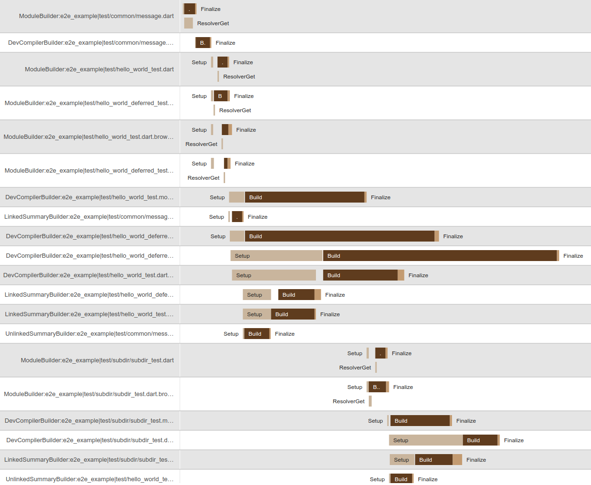

# Measuring performance with `build` and `build_runner`

You can enable performance tracking by passing the `--log-performance <dir>`
option (which will save logs to disk) or the `--track-performance` flag. Both of
these options will allow you to view the result in `serve` mode by navigating to
`/$perf`. On that page you will see a timeline something like this:

If you are using the `--log-performance <dir>` option that will save the logs to
disk so that you can attach them to bug reports.

Note that for larger builds it may take a while to load the timeline.

## Understanding the performance timeline

Each row in the timeline corresponds to a single "action" in the build, which
is a single `Builder` being applied to a single primary input file.

In the left hand column is the name of the builder, followed by a colon, and
then the `AssetId` for the primary input.

The time for each action is split into at 3 primary pieces:

-   **Setup**: Primarily this is time spent checking content hashes of inputs to
    see if the action needs to be reran.
    -   __Note__: This may also involve lazily building assets that were
        optional, so seeing a long time here is not unexpected.
-   **Build**: Time actually spent inside the `build` method of the `Builder`.
-   **Finalize**: Time spent updating the asset graph for all outputs, and some
    other cleanup.

If the builder uses a `Resolver`, you will also see a breakdown of time spent
getting the resolver. This will appear below the `build` time since it overlaps
with it.

### Slices

A "slice" is a piece of actual synchronous work, up to the granularity of the
[slices resolution](#slices-resolution) configuration, visualized as a
horizontal bar in a row in the graph. It does not include asynchronous work
(unless it is less than the slice resolution).

If [show async slices](#show-async-slices) is disabled, the granularity is
infinite, so a slice is just the entire time spent in a stage, including all
async work.

### Stage time, slice time, user time, and real time

Within each action (row), you can hover over one of the active time slices,
which will show several metrics, described as follows:

**Stage time**: The start and end time (relative to the start of the build) for
the stage of the time slice you are currently hovering over.

**Slice time**: The start and end time (relative to the start of the build) for
the slice.

**Slice duration**: The total time spent on the current slice.

**User time**: The actual time spent synchronously performing actions related to
the current stage. This does not count time spent waiting for asynchronous tasks.
This is generally the most relevant time, because asynchronous reads of assets
as an example may require actually building those files.

**Real time**: The total time between the start and end time of this stage. This
includes time waiting for asynchronous tasks.

## Configuring the timeline

### Hide skipped actions

Many actions in a build are "optional", which means they only run if some other
action asks to read their output. This setting toggles whether those rows
should be hidden or not.

### Show async slices

Off by default for performance reasons, this shows the actual synchronous points
in time during which the action was running, not including the time it spent
waiting for other async tasks.

This shows you visually how much time it spent waiting for other async tasks,
typically other build actions or a resolver.

### Slices resolution

For performance reasons, when show async slices is enabled, the actual slices
are grouped together if they occur within a certain amount of time from each
other. This setting configures that granularity, and is measured in
milliseconds.

Larger numbers will give less accurate but faster loads, smaller numbers are more
accurate but will slow down the performance of the visualization.

### Filter

This filters rows from the visualization based on a regex of the value in the
first column. This allows you to filter based on builder name or primary input.
